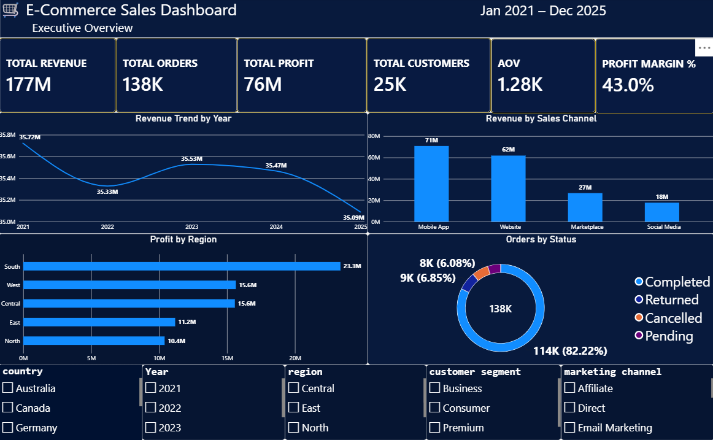
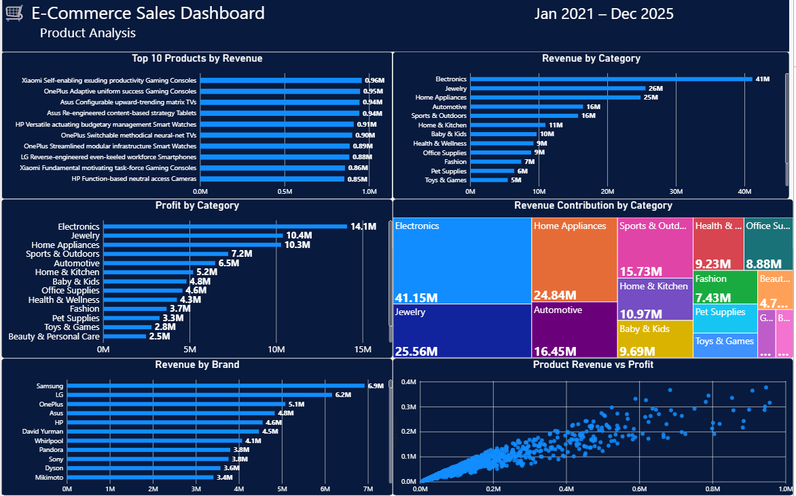
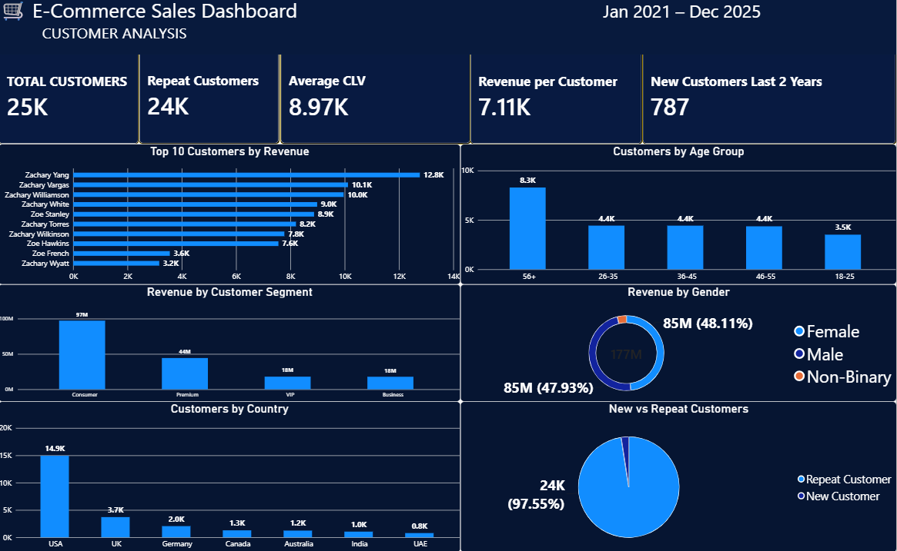
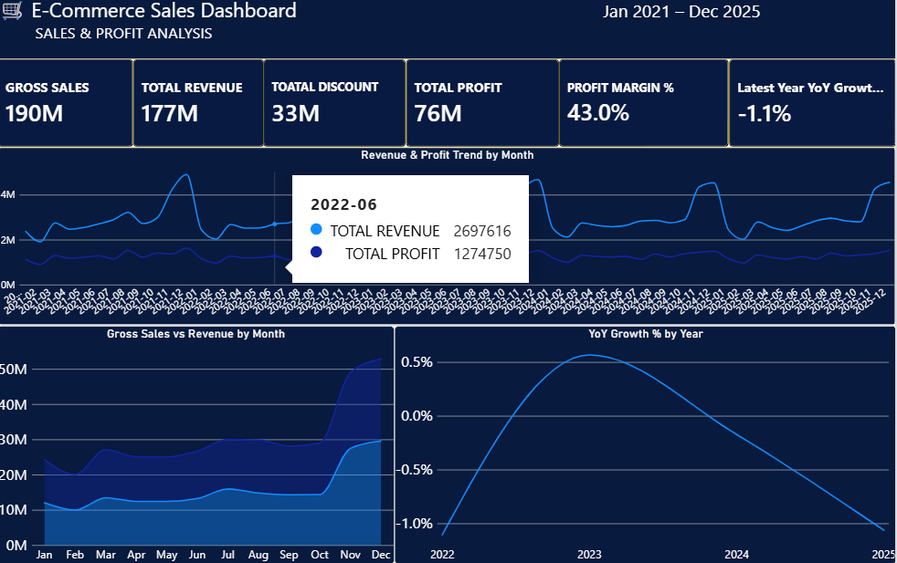
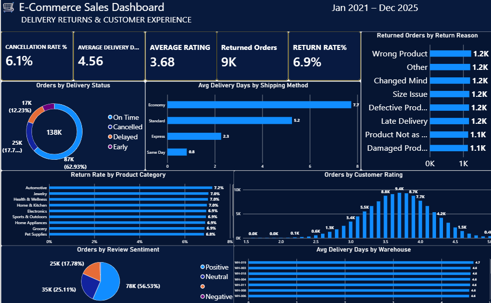
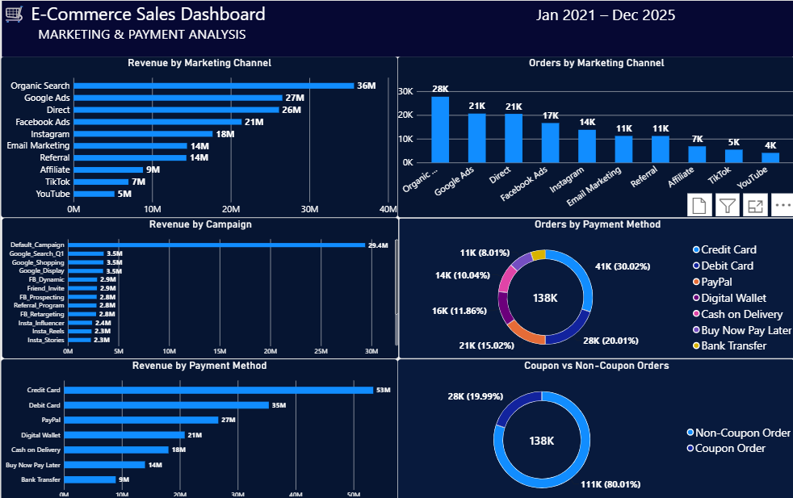
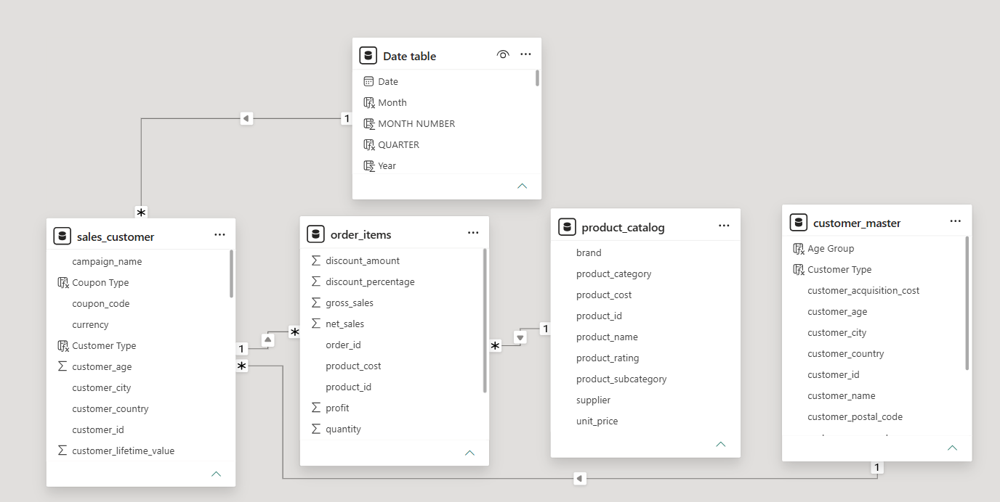

# 🛒 E-Commerce Sales Analytics Dashboard | Power BI

## 📌 Project Overview

This project is an interactive **E-Commerce Sales Analytics Dashboard** developed using **Microsoft Power BI**.

The dashboard analyzes e-commerce business performance across **sales, profitability, products, customers, marketing, payments, delivery, returns, and customer experience**.

The dataset covers the period from **January 2021 to December 2025** and includes more than **138K orders** and approximately **25K customers**.

The objective of this project is to transform raw e-commerce data into meaningful business insights using **Power Query, Data Modeling, DAX, and interactive Power BI visualizations**.

---

## 🛠️ Tools & Technologies

- Microsoft Power BI
- Power Query
- DAX (Data Analysis Expressions)
- Data Modeling
- Data Cleaning & Transformation
- Data Visualization
- Business Intelligence
- KPI Analysis

---

## 📊 Dashboard Pages

The Power BI report consists of **6 interactive dashboard pages**.

### 1️⃣ Executive Overview

Provides a high-level view of overall business performance.

**Key KPIs:**
- Total Revenue: **177M**
- Total Orders: **138K**
- Total Profit: **76M**
- Total Customers: **25K**
- Average Order Value: **1.28K**
- Profit Margin: **43%**

**Analysis Includes:**
- Revenue Trend by Year
- Revenue by Sales Channel
- Profit by Region
- Orders by Status
- Country, Year, Region, Customer Segment and Marketing Channel filters

---

### 2️⃣ Product Analysis

Analyzes product, category, and brand performance.

**Analysis Includes:**
- Top 10 Products by Revenue
- Revenue by Product Category
- Profit by Product Category
- Revenue Contribution by Category
- Revenue by Brand
- Product Revenue vs Profit Analysis

---

### 3️⃣ Customer Analysis

Provides insights into customer behavior and customer value.

**Key KPIs:**
- Total Customers: **25K**
- Repeat Customers: **24K**
- Average Customer Lifetime Value: **8.97K**
- Revenue per Customer: **7.11K**
- New Customers in 2024–2025: **787**

**Analysis Includes:**
- Top 10 Customers by Revenue
- Customers by Age Group
- Revenue by Customer Segment
- Revenue by Gender
- Customers by Country
- New vs Repeat Customers

---

### 4️⃣ Sales & Profit Analysis

Analyzes revenue growth and profitability trends.

**Key KPIs:**
- Gross Sales: **190M**
- Revenue: **177M**
- Discount Amount: **33M**
- Profit: **76M**
- Profit Margin: **43%**
- Latest YoY Growth: **-1.1%**

**Analysis Includes:**
- Revenue & Profit Trend by Month
- Gross Sales vs Revenue by Month
- Year-over-Year Revenue Growth

---

### 5️⃣ Delivery, Returns & Customer Experience

Analyzes operational performance and customer experience.

**Key KPIs:**
- Cancellation Rate: **6.1%**
- Average Delivery Days: **4.56**
- Average Customer Rating: **3.68**
- Returned Orders: **9K**
- Return Rate: **6.9%**

**Analysis Includes:**
- Orders by Delivery Status
- Average Delivery Days by Shipping Method
- Returned Orders by Return Reason
- Return Rate by Product Category
- Orders by Customer Rating
- Orders by Review Sentiment
- Average Delivery Days by Warehouse

---

### 6️⃣ Marketing & Payment Analysis

Analyzes marketing-channel and payment-method performance.

**Analysis Includes:**
- Revenue by Marketing Channel
- Orders by Marketing Channel
- Revenue by Campaign
- Orders by Payment Method
- Revenue by Payment Method
- Coupon vs Non-Coupon Orders

**Key Findings:**
- Organic Search generated the highest marketing-channel revenue at approximately **36M**.
- Credit Card generated the highest payment-method revenue at approximately **53M**.
- Approximately **20% of orders** used coupons.

---

## 🧮 Key DAX Measures

Some of the important DAX measures created for this project are shown below.

### Total Revenue

```DAX
Total Revenue =
SUM('sales_customer'[net_sales])
```

### Total Profit

```DAX
Total Profit =
SUM('sales_customer'[profit])
```

### Total Orders

```DAX
Total Orders =
DISTINCTCOUNT('sales_customer'[order_id])
```

### Total Customers

```DAX
Total Customers =
DISTINCTCOUNT('sales_customer'[customer_id])
```

### Average Order Value

```DAX
AOV =
DIVIDE(
    [Total Revenue],
    [Total Orders]
)
```

### Profit Margin %

```DAX
Profit Margin % =
DIVIDE(
    [Total Profit],
    [Total Revenue]
)
```

### Returned Orders

```DAX
Returned Orders =
CALCULATE(
    [Total Orders],
    'sales_customer'[order_status] = "Returned"
)
```

### Return Rate %

```DAX
Return Rate % =
DIVIDE(
    [Returned Orders],
    [Total Orders]
)
```

### Cancelled Orders

```DAX
Cancelled Orders =
CALCULATE(
    [Total Orders],
    'sales_customer'[order_status] = "Cancelled"
)
```

### Cancellation Rate %

```DAX
Cancellation Rate % =
DIVIDE(
    [Cancelled Orders],
    [Total Orders]
)
```

### Previous Year Revenue

```DAX
Previous Year Revenue =
CALCULATE(
    [Total Revenue],
    SAMEPERIODLASTYEAR('Date table'[Date])
)
```

### YoY Growth %

```DAX
YoY Growth % =
DIVIDE(
    [Total Revenue] - [Previous Year Revenue],
    [Previous Year Revenue]
)
```

---

# 📸 Dashboard Preview

## 1. Executive Overview



---

## 2. Product Analysis



---

## 3. Customer Analysis



---

## 4. Sales & Profit Analysis



---

## 5. Delivery, Returns & Customer Experience



---

## 6. Marketing & Payment Analysis



---

# 🗂️ Data Model

The Power BI project uses a relational data model connecting sales transactions, customers, order items, products, and a dedicated Date table.

### Main Tables

- `sales_customer`
- `order_items`
- `product_catalog`
- `customer_master`
- `Date table`

The model enables analysis across **orders, customers, products, dates, revenue, profitability, marketing, delivery, and returns**.



---

# 💡 Key Business Insights

- The dataset contains more than **138K orders** and approximately **25K customers**.
- The business generated approximately **177M in revenue** and **76M in profit**.
- Overall profit margin is approximately **43%**.
- Average Order Value is approximately **1.28K**.
- Organic Search generated the highest revenue among marketing channels.
- Credit Card was the highest-performing payment method by revenue.
- Repeat customers account for a major portion of the customer base.
- The overall return rate is approximately **6.9%**.
- The overall cancellation rate is approximately **6.1%**.
- The dashboard enables interactive analysis across customer segments, products, regions, marketing channels, payments, delivery performance, and returns.

---

# 📁 Repository Contents

| File | Description |
|---|---|
| `E-Commerce-Sales-Dashboard.pbix` | Complete Power BI dashboard file |
| `01-executive-overview.png` | Executive Overview dashboard |
| `02-product-analysis.png` | Product Analysis dashboard |
| `03-customer-analysis.png` | Customer Analysis dashboard |
| `04-sales-profit-analysis.png` | Sales & Profit Analysis dashboard |
| `05-delivery-returns-analysis.png` | Delivery & Returns dashboard |
| `06-marketing-payment-analysis.png` | Marketing & Payment dashboard |
| `data-model.png` | Power BI data model |
| `README.md` | Project documentation |

---

# 🎯 Project Objective

The objective of this project is to demonstrate practical Data Analyst skills in:

- Data Cleaning & Transformation
- Power Query
- Data Modeling
- DAX
- KPI Development
- Data Visualization
- Sales Analysis
- Profitability Analysis
- Customer Analysis
- Product Analysis
- Marketing Analysis
- Operational Analysis
- Business Intelligence Reporting

---

# 🚀 How to View the Project

1. Download `E-Commerce-Sales-Dashboard.pbix`.
2. Open the file using **Microsoft Power BI Desktop**.
3. Navigate through the six dashboard pages.
4. Use the interactive slicers and filters to explore the data.

---

# 👤 Author

**Chandan Prasad**

Aspiring Data Analyst | Power BI | Excel | SQL | Data Analytics

GitHub: [Chandanprasad7](https://github.com/Chandanprasad7)

---

⭐ If you found this project useful, feel free to star the repository.
